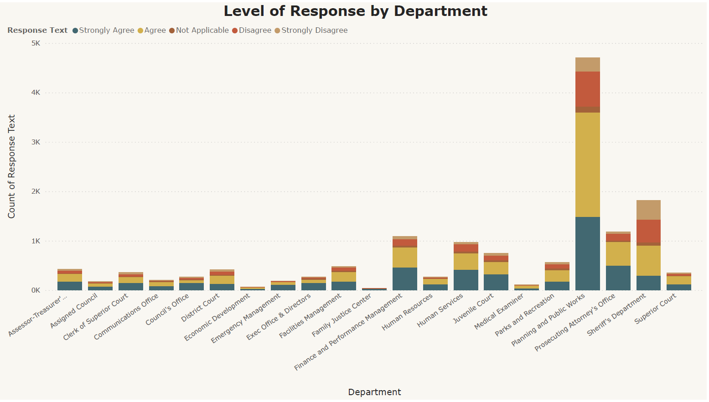

# Employee Survey Response

## Introduction 
This is a power BI project on the analysis of the employee engagement survey responses conducted by **Pierce County WA** and completed voluntarily by government employees. 

## Problem Statement
- Which survey questions did respondents agree with or disagree with most?
- Are there any patterns or trends by department or role?
- What steps might the employers take to improve employee satisfaction based on the survey results?

## Skills / Concepts Demonstrated
The following Power BI features were used
- DAX
- ⁠Page navigation
- ⁠filters

Employees were presented with 10 questions and asked to express their preferences using a scale of five options: Strongly Agree, Agree, Not Applicable, Disagree, and Strongly Disagree.

- I know what is expected of me at work
- At work, I have the opportunity to do what I do best every day
- In the last seven days, I have received recognition or praise for doing good work
- My supervisor, or someone at work, seems to care about me as a person
- The mission or purpose of our organization makes me feel my job is important
- I have a best friend at work
- This last year, I have had opportunities at work to learn and grow
- My supervisor holds employees accountable for performance
- My department is inclusive and demonstrates support of a diverse workforce
- Overall I am satisfied with my job

This dashboard above provides employers with insights into the collective sentiment of employees for each question, highlighting the prevailing feelings among the workforce.

## Analysis and Recommendation 
- According to the survey findings, the question **I know what is expected of me at work** received the highest agreement from respondents, indicating a strong consensus. On the other hand, the question **I have a best friend at work** garnered the highest level of disagreement among the participants.
- The _Planning & Public Works_ department had a higher level of participation in the survey, while the _Family Justice Center_ department exhibited the lowest level of participation. 
- The employers can improve communication channels to keep the employees informed about organizational changes, updates, and expectations.
- They should encourage team-building activities to strengthen relationships and create a sense of mutual trust and friendship among the employees.
- They should cultivate a positive workplace culture by recognizing and appreciating employee contributions.
- They should provide training programs to address skill gaps identified in the survey and empower employees to excel in their roles. 
- They can develop clear career paths and provide growth opportunities for employees to advance within the organization.
